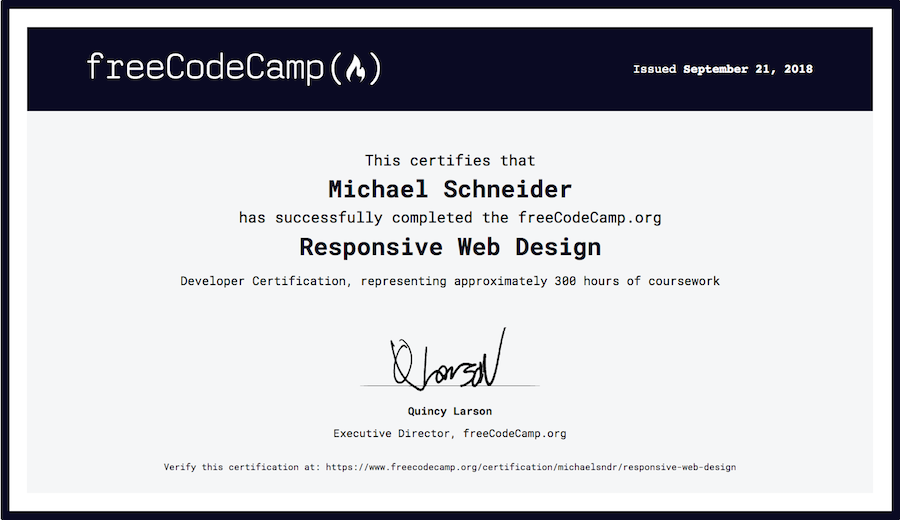

# freecodecamp-projects
I am working through the [freeCodeCamp curriculum](https://www.freecodecamp.org/learn/) and these are the projects I created for the Responsive Web Design Certification. Each one includes a test suite that checks whether freeCodeCamp's requirements are met.

1. Tribute Page: [view](https://michaelsndr.github.io/freecodecamp-projects/01-responsive-web-design/01-tribute-page/), [code](https://github.com/michaelsndr/freecodecamp-projects/tree/master/01-responsive-web-design/01-tribute-page)
2. Survey Form: [view](https://michaelsndr.github.io/freecodecamp-projects/01-responsive-web-design/02-survey-form), [code](https://github.com/michaelsndr/freecodecamp-projects/tree/master/01-responsive-web-design/02-survey-form)
3. Product Landing Page: [view](https://michaelsndr.github.io/freecodecamp-projects/01-responsive-web-design/03-product-landing-page), [code](https://github.com/michaelsndr/freecodecamp-projects/tree/master/01-responsive-web-design/03-product-landing-page)
4. Technical Documentation Page: [view](https://michaelsndr.github.io/freecodecamp-projects/01-responsive-web-design/04-technical-documentation-page), [code](https://github.com/michaelsndr/freecodecamp-projects/tree/master/01-responsive-web-design/04-technical-documentation-page)
5. Personal Portfolio Page: [view](https://michaelsndr.github.io/freecodecamp-projects/01-responsive-web-design/05-personal-portfolio-page), [code](https://github.com/michaelsndr/freecodecamp-projects/tree/master/01-responsive-web-design/05-personal-portfolio-page)

verifiable [here](https://www.freecodecamp.org/certification/michaelsndr/responsive-web-design)